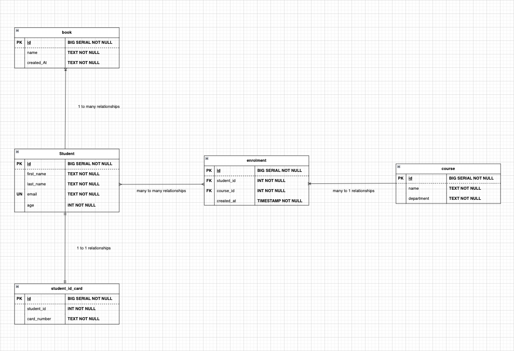

# Spring Data JPA
This is a scalable backend spring data application that builds on postgreSQL.

Backend database is built on the following tables:
```
1️⃣ - Student
2️⃣ - StudentIdCard
3️⃣ - Book
4️⃣ - Courses
5️⃣ - Enrolment
```

# Table Features



### In this initial implementation:
Build the dependencies and connect to the PostgreSQL database.

## License
This program is released under the MIT License.

## Acknowledgements
The Car Booking System was developed by [https://github.com/iabdinur]